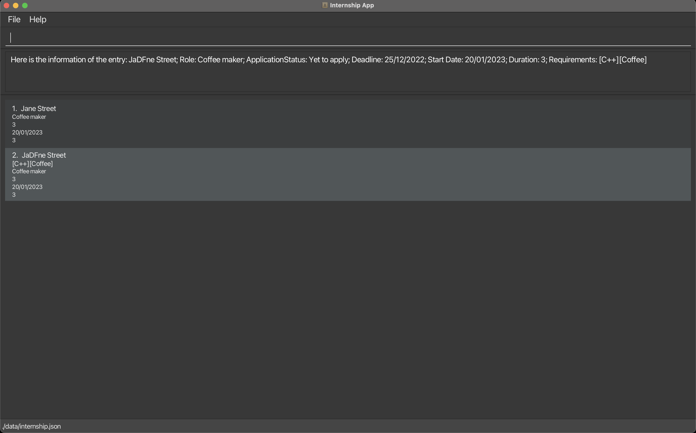

# Flagship Internship Manager
Flagship Internship Manager allows you to track, manage, and organize internship entries efficiently. Here's a guide to understand and use the system.

## Data Types and Constraints
### {startDate}:
Format: DD/MM/YYYY
Constraints: Must be valid date with exactly 2 characters for day and month, and 4 characters for the year. All segments must be integers.
### {duration}:
Format: Integer
Constraints: Must be a positive integer.
### {companyName}:
Constraints: Cannot be empty.
### {role}:
Constraints: Cannot be empty.
### {requirements}:
Constraints: Must be separated by '|'. Cannot be empty or have duplicates. '|' is treated as a special character and cannot be part of a requirement.
### {applicationStatus}:
Valid Values: Yet to apply, Applied, In Progress, Accepted, Rejected.
## Commands
### 1. Create
Purpose: Add a new internship entry.

**Example:**
Copy code
user Input: create
Prompt: Enter the internship’s start date in DD/MM/YYYY format.
user Input: 20/02/2001
... [other prompts and inputs as described]

**Success Output:**
Here is the information of the entry:
Start Date: {startDate}
... [other fields displayed]

**Error Messages:**
The value entered for this field is invalid.
This field is compulsory, please do not leave it empty.
### 2. Read
Purpose: Display details of a specific internship entry.

**Example:**
read 1

**Success Output:**
Here is the information of entry {number}:
Start Date: {startDate}
... [other fields displayed]

**Error Messages:**
There are no internship entries associated with {number}.
“read” expects 1 numeric parameter.

### 3. List
Purpose: Display all internship entries.
list

**Success Output:**
Here are your internship entries:
... [entries displayed]

**Error Message:**
“list” expects no parameters.

### 4. Update
Purpose: Edit an existing internship entry.

**Example:**
user Input: update 1
... [prompts and user inputs as described]

**Success Output:**
Entry at {number} has been updated. Exited editing mode.

**Error Messages:**
Error updating internship entry at {number}.
“update” expects 1 numeric parameter.

### 5. Delete
Purpose: Remove an existing internship entry.

delete {number}

**Example:**
delete 1

**Success Output:**
{companyName} at {number} is deleted.

**Error Messages:**
There are no internship entries associated with {number}.
“delete” expects 1 numeric parameter.

Thank you for using Flagship Internship Manager! If you have any feedback or issues, please contact support.
