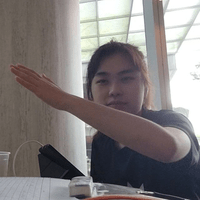

# About Us

We are a team based in the [School of Computing, National University of Singapore](http://www.comp.nus.edu.sg).

You can reach us at the email `e0958417@u.nus.edu`

## Project team

### Chen Jin Yang

[[homepage](https://www.linkedin.com/in/chen-jin-yang-37baa8202/)]
[[github](https://github.com/jinyang628)]
[[portfolio](team/jinyang628.md)]

* Role: Project Advisor

### Javin Chua

[[github](http://github.com/javinchua)]
[[portfolio](team/javinchua.md)]

* Role: Team Lead
* Responsibilities: UI

### Lee Yong Ning

[[github](http://github.com/yongning0310)] 
[[portfolio](team/yongning.md)]

* Role: Developer
* Responsibilities: Data

### Kyriel Mortel Abad

[[github](http://github.com/s-kybound)]
[[portfolio](team/s-kybound.md)]

* Role: Developer
* Responsibilities: Dev Ops + Threading

### Shashamin Chokjaroenwathanakul

[[github](http://github.com/shashahchk)]
[[portfolio](team/shashamin.md)]

* Role: Developer
* Responsibilities: UI
