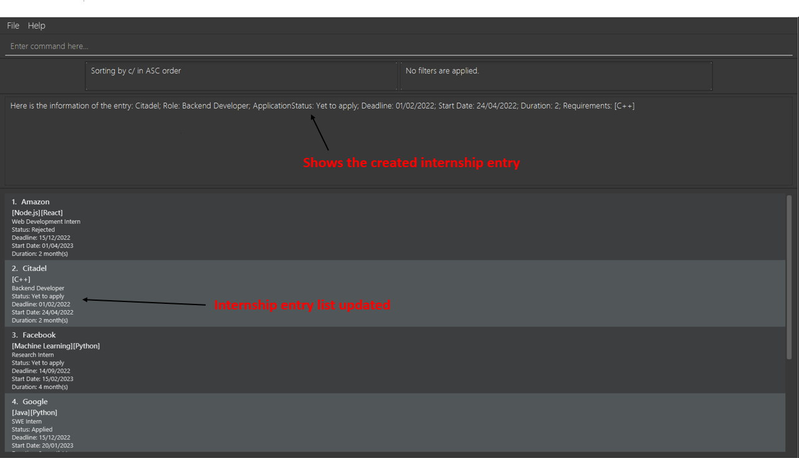
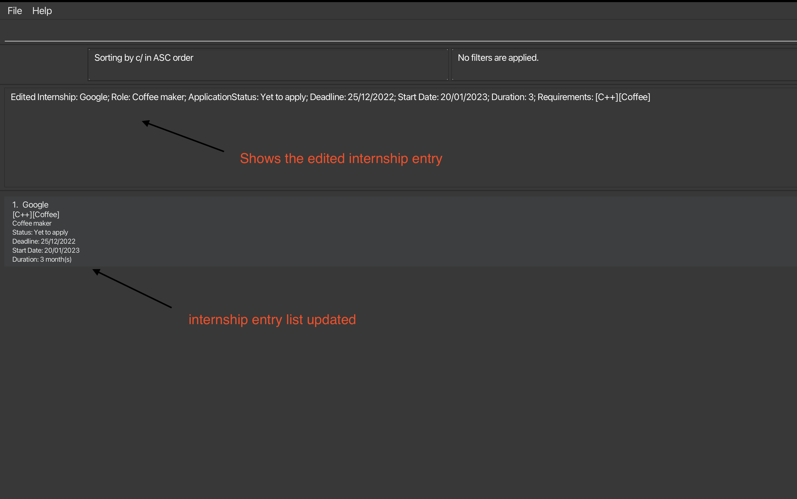
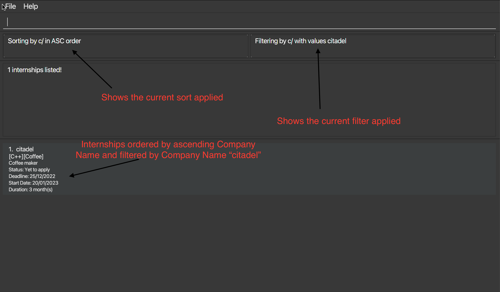
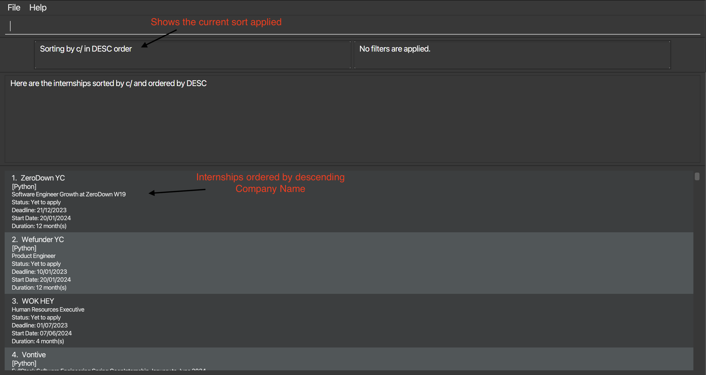

<br>
# Flagship User Guide
<br>

## Table of Contents

1. [Introduction](#introduction)
2. [Using this guide](#using-this-guide)
3. [Common Markers](#common-markers)
4. [Glossary](#glossary)
5. [Quick Start](#quick-start)
6. [Command Format Notes](#commands-format-notes)
7. [Parameter Constraints](#parameter-constraints)
8. [Commands](#commands)
    1. [Creating an Internship](#creating-an-internship-create)
    2. [Editing an Internship](#editing-an-internship-modify)
    3. [Filter Internships by Name and Keyword](#filter-internships-by-category-and-keywordrange-filter)
    4. [Sort Internships by Category and Order](#sort-internships-by-category-and-order-sort)
    5. [Deleting an Internship](#deleting-an-internship-delete)
9. [Saving the data](#saving-the-data)
10. [Editing the data file](#editing-the-data-file)
11. [FAQ](#faq)
12. [Known Issues](#known-issues)
13. [Command Summary](#command-summary)

--------------------------------------------------------------------------------------------------------------------
<br>
<div style="page-break-after: always;"></div>

## Introduction

Flagship is a desktop app for managing internship applications, optimized for use via a [Command Line Interface](#glossary)
(CLI). There is always a swarm of information to keep track of every application season, and many people miss out on important deadlines
and valuable opportunities because information is not organised neatly. With Flagship, we want you to focus on preparing
for the interviews, and leave the application management to us.

Flagship has a host of awesome features that we are extremely proud of:
1. **Sorting** internships based on deadlines
2. **Filtering** internships based on interested roles
3. **Modifying** existing entries in accordance with updates

_... and many more!_

Our main target users are english-speaking university students pursuing a computing-related degree. 
As such, this user guide (and Flagship in general) is designed with the following assumptions in mind:
1. You have a basic understanding of command line syntax.
2. You are comfortable using the [command terminal](#glossary) to launch the application.
3. You type fast and enjoy using the keyboard as the main tool of navigation.

If these characteristics sound like you, Flagship can get your internship management tasks done faster than traditional GUI apps.

That said, do not get too intimidated as we have kept the launching process and commands as simple as possible. You
do not need prior knowledge of industry-level command line syntax to use this application effectively.


--------------------------------------------------------------------------------------------------------------------
<br>

## Using this guide

We understand that navigating an application for the first time can be incredibly intimidating. As such, we have devised this
user guide to alert you to the main difficulties faced by new users, and inform you of the key features that you can utilise
in your internship management journey. Here is a rundown of how you can use this guide effectively.

1. If you are running Flagship for the **first time**, start with our [Quick Start](#quick-start) section
2. If you want a **detailed breakdown** of how each command works, have a read of our [Commands Section](#commands).
2. If you are an **experienced Flagship user** who wants to have a quick check of the command syntax, jump
right to the [Command Summary](#command-summary).


--------------------------------------------------------------------------------------------------------------------
<br>
<div style="page-break-after: always;"></div>

## Common Markers

Throughout the user guide, you will see these colored blocks of code that contain important information.

<div markdown="block" class="alert alert-success">
    💡 Green blocks contain tips to enhance your experience using Flagship.
</div>

<div markdown="block" class="alert alert-info">
    ℹ️ Blue blocks contain useful information to address doubts you might have.
</div>

<div markdown="span" class="alert alert-danger">
    ⚠️ Red blocks contain warnings that you must heed so that Flagship works as intended.
</div>

<div style="page-break-after: always;"></div>

<!-- * Table of Contents -->
<page-nav-print />


--------------------------------------------------------------------------------------------------------------------
<br>

## Glossary
* **[Command Line Interface (CLI)](https://en.wikipedia.org/wiki/Command-line_interface)** : A text-based interface where you can input commands to interact with the computer's programs.
* **Command terminal**: A terminal is a text input and output environment. It is mainly used to launch the application for our purposes. Open your terminal by:
    * Searching and clicking `Command Prompt` on Windows.
    * Searching and clicking `Terminal` on Mac and Linux (Ubuntu).
* **Parameters**: Parameters are additional information the command needs in order for it to perform its function successfully.
* **JSON**: JSON is a lightweight format for storing and transporting data so that both humans and computers can easily read and understand it.


--------------------------------------------------------------------------------------------------------------------
<br>
<div style="page-break-after: always;"></div>

## Quick Start

Let's start tracking your internship applications right now!
1. Ensure you have Java `11` or above installed in your computer.

2. Download the latest `flagship.jar` from [here](https://github.com/AY2324S1-CS2103T-W17-1/tp/releases/tag/v1.4).

3. Copy the file to the folder you want to use as the _home folder_ for Flagship.

4. Open a command terminal, `cd` into the folder you put the jar file in, and use the `java -jar flagship.jar` command to run the application.<br>

<div markdown="block" class="alert alert-info">
    ℹ️ Note that Flagship does not have any operating systems requirements and this process is the same regardless whether you use Windows or Mac!
</div>

5. A GUI similar to the image below should appear in a few seconds. Notice how we have already included some sample internship applications for you!<br>
   

6. Experiment with some commands within the input field and press <kbd>Enter</kbd> to execute it <br>

<div markdown="block" class="alert alert-success">
💡 Some example commands you can try: <br><br>

    # Creates an internship entry for the company `GovTech` in Flagship.
    create c/GovTech ro/SWE a/Yet to apply de/01/06/2022 s/20/01/2023 du/3 re/C++

    # Deletes the 3rd internship entry shown in the current list.
    delete 3

For the full list of executable commands, refer to the [Commands](#commands) Section.
</div>


--------------------------------------------------------------------------------------------------------------------
<br>
<div style="page-break-after: always;"></div>

## Commands Format Notes

Flagship is powered by commands from your keyboard! All of our features can be accessed by executing various commands.

Here is the command format that will guide you in keying in what is necessary for each command. We will be using the <kbd>create</kbd> command
of the following format `create c/COMPANY_NAME ro/ROLE a/APPLICATION_STATUS de/DEADLINE s/START_DATE du/DURATION [re/REQUIREMENT]...` as
an example.

- The **first word** describes the type of command you want to execute. For the above command, you are executing a <kbd>create</kbd> command.

- **Prefixes** such as <kbd>c/</kbd> serve as the labels for the [parameters](#glossary) in our commands.

- Parameters in <kbd>UPPER_CASE</kbd> are to be supplied by you. For the above command, you might input:

```
create c/GovTech ro/SWE a/Yet to apply de/25/12/2022 s/20/01/2023 du/3 re/C++
```
- **Parameters in square brackets <kbd>[]</kbd>** are optional and can be omitted. For the above command, you can choose not to input a single requirement.

```
create c/GovTech ro/SWE a/Yet to apply de/25/12/2022 s/20/01/2023 du/3
```
- **Parameters with <kbd>...</kbd> behind** can be used multiple times. For the above command, you can input many requirements.

```
create c/GovTech ro/SWE a/Yet to apply de/25/12/2022 s/20/01/2023 du/3 re/C++ re/Java
```

- Parameters can be entered in any order.
    - For instance, both `c/COMPANY_NAME ro/ROLE` and `ro/ROLE c/COMPANY_NAME` are valid.

<div markdown="block" class="alert alert-success">
💡 If you are using a PDF version of this document, be careful when copying and pasting commands that span multiple 
lines as space characters surrounding line-breaks may be omitted when copied over to Flagship.
</div>

--------------------------------------------------------------------------------------------------------------------
<br>
<div style="page-break-after: always;"></div>

## Parameter constraints

All of our parameters have certain constraints associated with them. Although they may seem cumbersome at first, these constraints
allow Flagship to help you detect typos and make retrieving data far easier!

| Parameter              | Prefix | Accepted Format                                                                                                                                                       | Compulsory? | Example                               |
|------------------------|--------|-----------------------------------------------------------------------------------------------------------------------------------------------------------------------|-------------|---------------------------------------|
| **Company Name**       | `c/`   | **`COMPANY_NAME`** <br> `COMPANY_NAME` can contain these characters: `A-Z a-z 0-9` and `<space>`. Cannot **exclusively** contain `<space>` and exceed 200 characters. | Yes         | `Optiver`, <br> `Jane Street`         |
| **Role**               | `ro/`  | **`ROLE`** <br> `ROLE` can contain these characters: `A-Z a-z 0-9` and `<space>`. Cannot **exclusively** contain `<space>` and exceed 200 characters.                 | Yes         | `Software Engineer`, <br> `Fullstack` |
| **Application Status** | `a/`   | **`APPLICATION_STATUS`** <br> `APPLICATION_STATUS` must be one of the following: `Yet to apply`, `Applied`, `In progress`, `Accepted`, `Rejected`.                    | Yes         | N.A                                   |
| **Deadline**           | `de/`  | **`DEADLINE`** <br> `DEADLINE` must be of the following form `DD/MM/YYYY` and must be **earlier** than the `START_DATE`.                                              | Yes         | `20/02/2001`, <br> `01/01/2000`       |
| **Start Date**         | `s/`   | **`START_DATE`** <br> `START_DATE` must be of the following form `DD/MM/YYYY` and must be **later** than the `DEADLINE`.                                              | Yes         | `20/02/2001`, <br> `01/01/2000`       |
| **Duration**           | `du/`  | **`DURATION`** <br> `DURATION` must be a positive integer.                                                                                                            | Yes         | `1`, <br> `10`                        |
| **Requirements**       | `re/`  | **`REQUIREMENTS`** <br> `REQUIREMENTS` cannot contain foreign language characters, **exclusively** contain `<space>` and exceed 200 characters.                       | No          | `C++`, <br> `Haskell`                 |

<div markdown="block" class="alert alert-info">
ℹ️ We understand that our constraints might be rigid in some cases. For example, it is possible for company names to contain
special characters. However, we believe that these cases are rare and loosening the parameter constraints will increase the
probability of typos and reduce the effectiveness of our filter functionalities.
</div>

<div markdown="block" class="alert alert-info">
ℹ️ Flagship directly helps you correct any leap year related errors. For example, if you key in 29/02/2021 even though
2021 is not a leap year, we will round it down to 28/02/2021 for you. 
</div>

--------------------------------------------------------------------------------------------------------------------
<br>

<div style="page-break-after: always;"></div>
## Commands


### Creating an Internship: `create`

Found an internship opportunity that you really want to apply for? Or have you submitted an internship application
and wish to keep tabs of its progress in the future? Create an internship entry that can be stored in Flagship so that
you will never lose track of it!

**Format**: `create c/COMPANY_NAME ro/ROLE a/APPLICATION_STATUS de/DEADLINE s/START_DATE du/DURATION [re/REQUIREMENTS]...`

**Example**: `create c/Citadel ro/Backend Developer a/Yet to apply de/01/02/2022 s/24/04/2022 du/2 re/C++`

**Interpretation**: Create an internship entry for **Citadel**. This is a **Backend Developer** role that you have
**yet to apply** for. The deadline for the application is **1 February 2022**, and the internship is expected to start
on **24 April 2022**. This is a **2-month** internship, and you are expected to be proficient in **C++**.

<div markdown="span" class="alert alert-danger">
⚠️ Flagship does not allow you to create duplicate internship entries with both the same company name and role. This makes sure
that you do not accidentally track an internship application twice. The following list below describes what constitutes identical entries.
</div>

| Description                                                                                           | Example                                                                   |
|-------------------------------------------------------------------------------------------------------|---------------------------------------------------------------------------|
| **Company names/roles only differ in upper/lower cases**                                              | `Jane Street`, `jane Street` and `jANe strEEt` are considered the same    |
| **Company names/roles only differ in leading/trailing white spaces** (Using dots to represent spaces) | `...Jane Street`, `Jane Street...`, `Jane Street` are considered the same |
| **Combination of differences only in upper/lower cases and leading/trailing white spaces**            | `Jane street...`, `...jane StReet` are considered the same                |

**All other differences** between two internship entries' company name and role will cause them to be considered as distinct entries.

<div markdown="block" class="alert alert-info">
ℹ️ We do not allow you to create internship entries of a different application status, duration, etc. but with the same
company name and role, because we believe that these cases are less likely to exist (but still possible!). If we loosen
our definition of identical internship entries further, Flagship will not be able to catch your accidental duplicate entries
as effectively.
</div>

<div markdown="block" class="alert alert-info">
ℹ️ We allow you to create internship entries with application deadlines and start dates before today's current date. It is designed as such 
so that you can track your past internship applications for your own reference. 
</div>

<div markdown="block" class="alert alert-success">
💡 Internship entries can have multiple requirements, or even none at all. However, all other attributes are compulsory!
</div>

**Expected Output**:


<br>


### Editing an Internship: `modify`

Need to update an existing internship entry? The `modify` command lets you adjust the details of your applications in Flagship. 
Whether the application deadline has changed or you've picked up a new skill that meets the job requirements, modify your entry to ensure that your internship application details are current.

**Format**: `modify INDEX c/COMPANY_NAME ro/ROLE a/APPLICATION_STATUS de/DEADLINE s/START_DATE du/DURATION [re/REQUIREMENTS]...`

**Example**: `modify 1 c/Jane Street ro/Backend Developer a/Yet to apply de/29/11/2022 s/20/01/2023 du/3 re/C++ re/Python`

**Interpretation**: Update the first internship entry on your Flagship list. The role is at **Jane Street** for a **Backend Developer** position that you have **yet to apply**. The **application deadline** is set for 29 November 2022, and the start date is 20 January 2023. The internship is for a **3-month** period, with requirements for proficiency in **C++** and **Python**.

<div markdown="block" class="alert alert-info">
💡 You can selectively update the details of an internship entry. Attributes not included in the command will maintain their existing values.
</div>

<div markdown="span" class="alert alert-danger">

⚠️ **Internship Entry Modification Policies:**

- **INDEX is Mandatory**: The INDEX, a positive integer, is required to identify the entry's position in the list. Modifying an entry will replace the existing list, not add to it.
- **No Duplicate Company Name and Role**: Editing to create a duplicate entry with the same company name and role as an existing internship entry is not permitted, ensuring consistency with the create command section's prohibition of duplicates.
- **Parameter Requirement**: There must be at least one parameter following the INDEX when modifying an entry. Omission of parameters will trigger an error message.
</div>

**Expected Output**:


<br>

### Filter Internships by Category and Keyword/Range: `filter`

Want to focus only on relevant internship entries based on certain constraints? 
Filter internship entries by inputting any category. 
There are 2 category types: `CATEGORY_TYPE1` accepting text inputs and `CATEGORY_TYPE2` accepting a range of values. The category types are as follows:

* `CATEGORY_TYPE1`: `c/`, `ro/`, `a/`, `re/`
  * Representing **Company Name**, **Role**, **Application Status** and **Requirements**
* `CATEGORY_TYPE2`: `de/`, `s/`, `du/`
  * Representing **Deadline**, **Start Date** and **Duration**

Format 1: `filter [CATEGORY_TYPE1]/[KEYWORDS]`

<div markdown="span" class="alert alert-danger">

⚠️  **Internship Entry Filter (Format 1) Policies:**
- **Case Insensitive**: The search ignores cases.
- **Multiple Keywords Accepted**: You can input multiple `KEYWORDS` parameters separated by spaces. The search displays internship entries that match at least one of the `KEYWORDS`. 
- **Full-word Matches**: The search only displays internship entries with full-word matches. `KEYWORDS` should be complete words.
</div>

Examples:
* `filter c/JANE` displays internship entries with `COMPANY_NAME` containing **JANE**, **Jane**, **jane**, or any other variations in cases.
* `filter re/python c++` displays internship entries with `REQUIREMENTS` containing **python** and/or **c++**.
* `filter c/tech` displays internship entries with company names containing "tech company" but not "technology company" as per the full-word match requirement.

Format 2: `filter [CATEGORY_TYPE2]/[START-END]`

<div markdown="span" class="alert alert-danger">

⚠️  **Internship Entry Filter (Format 2) Policies:**
- **Range is Mandatory**: Flagship only allows filter by range for this category type. To filter for one value, you can input the range as `VALUE-VALUE`.
- **Parameter Requirement**: Each parameter should follow the parameter constraints specified under the [Commands](#commands) Section.
</div>

Examples:
* `filter du/3-6` displays internship entries that have durations within the range 3 to 6 months inclusive.
* `filter du/4-4` displays internship entries that have a duration of 4 months.
* `filter de/20/12/2023-20/01/2024` displays internship entries that have deadline within the range of 20/12/2023 to 20/01/2024 inclusive.

Format 3: `filter default`

Examples: 
* `filter default` clears the existing filter and lists all internship entries.

<div markdown="block" class="alert alert-success">
💡 If you execute a new filter command, it supersedes the previous filter. Otherwise, the initial filter remains active.
</div>

**Expected Output**:


<br>

### Sort Internships by Category and Order: `sort`

Have a growing list of internship entries and finding it challenging to prioritize? Or perhaps you're looking to identify 
opportunities with the nearest deadlines or those that align with a specific field of interest? Use the sort feature in 
Flagship to organize and arrange your internship list based on specific categories and order.

**Format**: `sort [CATEGORY]/[ASC/DESC]`

* `ASC` indicates ascending order, and `DESC` denotes descending order.

**Examples**:
* `sort c/ASC` sorts entries by company name (ascending).
* `sort default` resets the list to default, which is in order of company name (ascending).

<div markdown="block" class="alert alert-success">
💡 Internship entries are by default sorted by company name in ascending order.
</div>

<div markdown="block" class="alert alert-info">
ℹ️ We do not allow you to stack sorts. A subsequent `sort` command will replace the prior one. Otherwise, the initial sort remains effective.
</div>

<div markdown="block" class="alert alert-info">
ℹ️ We do not allow you to sort by requirements because it involves comparing different sets of items between internships, which doesn't have a straightforward or meaningful order.
</div>

**Expected Output**:


<br>

### Deleting an Internship: `delete`

Trying to declutter your list of internship entries? Or has a saved internship application become irrelevant because you no longer want to apply for the position? 
Remove the internship entry from Flagship using our delete command!

**Format**: `delete INDEX`

* Erase the internship entry at the designated `INDEX`.
* The index **must be a positive integer** like 1, 2, 3, …​

**Examples**:
* `delete 2` removes the 2nd internship entry from the directory.

<div markdown="block" class="alert alert-info">
ℹ️ The index is the position of the specified internship entry in the list currently displayed. 
This means that even if you have applied sorting or filtering to your list, the index will always be consistent with the 
internship entry's visible position on the screen.
</div>

**Expected Output**:


--------------------------------------------------------------------------------------------------------------------
<br>

## Saving the data

Flagship data is saved in the hard disk automatically. There is no need to save manually.

--------------------------------------------------------------------------------------------------------------------
<br>

## Editing the data file

Flagship data is saved automatically as a [JSON](#glossary) file `[JAR file location]/data/internshipBook.json`. Advanced users are welcome to update data directly by editing that data file.

<div markdown="span" class="alert alert-danger">
⚠️ If your changes to the data file make it invalid, such as adding invalid formatting or duplicate internship entries, Flagship will discard all data and start with an empty data file at the next run.
Hence, it is recommended to take a backup of the file before editing it.
</div>

<div markdown="span" class="alert alert-danger">
⚠️ Flagship is not optimised to handle excessively large number of internship entries — we believe that it is extremely rare for you 
to track more than a thousand entries at any point in time. If you were to edit the data file, do not insert too many entries
or Flagship might crash. 
</div>


--------------------------------------------------------------------------------------------------------------------
<br>

## FAQ

**Q**: How do I transfer my data to another Computer?<br>
**A**: Install Flagship in the other computer. Overwrite the empty data file it creates with the data file of your previous Flagship home folder.

--------------------------------------------------------------------------------------------------------------------
<br>

## Known Issues

1. **When using multiple screens**, if you move the application to a secondary screen, and later switch to using only the primary screen, the GUI will open off-screen. The remedy is to delete the `preferences.json` file created by the application before running the application again.

--------------------------------------------------------------------------------------------------------------------
<br>

## Command Summary

| Action     | Format, Examples                                                                                                                                                                                                                            |
|------------|---------------------------------------------------------------------------------------------------------------------------------------------------------------------------------------------------------------------------------------------|
| **Create** | `create c/COMPANY_NAME ro/ROLE a/APPLICATION_STATUS de/DEADLINE s/START_DATE du/DURATION re/REQUIREMENTS...​` <br> e.g., `create c/Jane Street ro/ML Engineer a/Yet to apply de/15/12/2022 s/20/01/2023 du/3 re/C++ re/Java`                |
| **Modify** | `modify INDEX c/COMPANY_NAME ro/ROLE a/APPLICATION_STATUS s/START_DATE de/DEADLINE du/DURATION re/REQUIREMENTS...` <br> e.g., `modify 1 c/Jane Street ro/Backend Developer a/Yet to apply de/29/11/2022 s/20/01/2023 du/3 re/C++ re/Python` |
| **Filter** | `filter [CATEGORY_TYPE1]/[KEYWORD]` OR `filter [CATEGORY_TYPE2]/[START-END]` <br> e.g.,   `filter c/JA ro/SWE` OR `filter du/3-6`                                                                                                           |
| **Sort**   | `sort [CATEGORY]/[ASC/DESC]` <br> e.g.,  `sort de/ASC`                                                                                                                                                                                      |
| **Delete** | `delete INDEX`<br> e.g., `delete 2`                                                                                                                                                                                                         |


